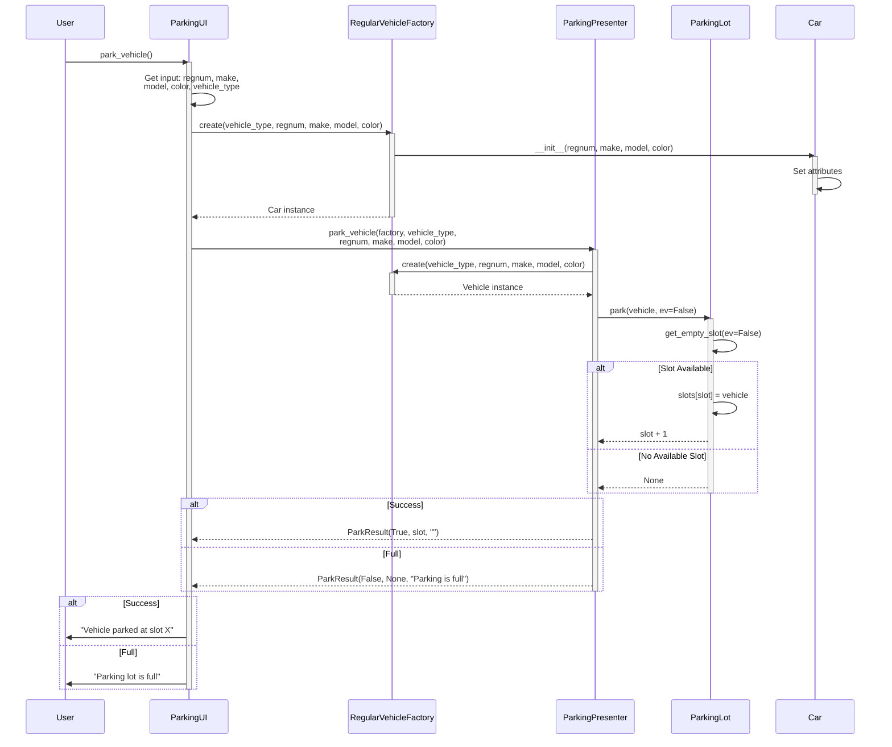
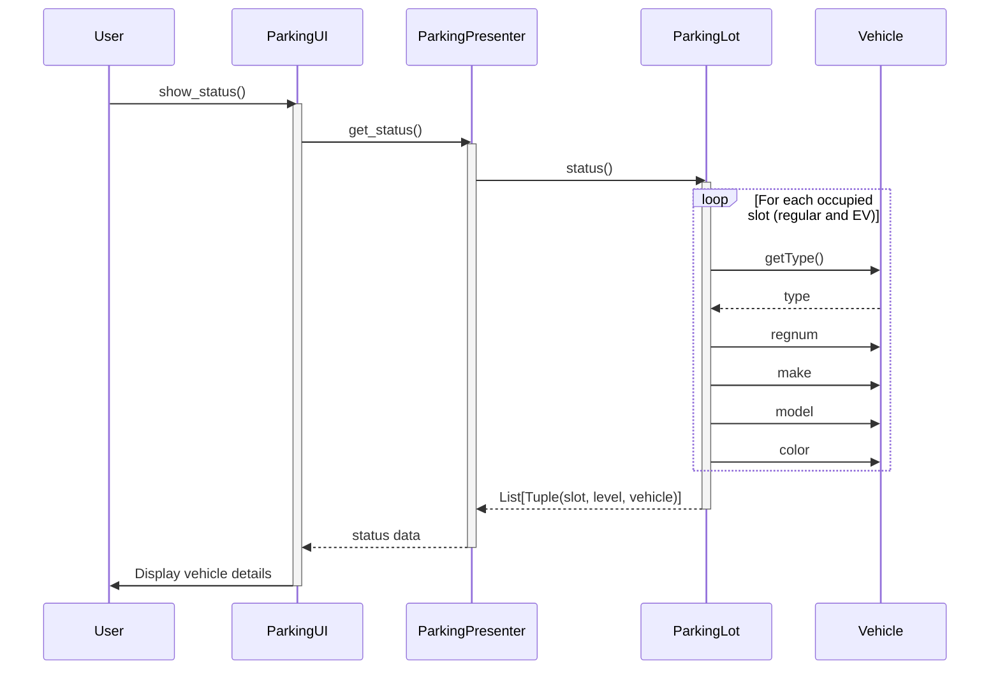
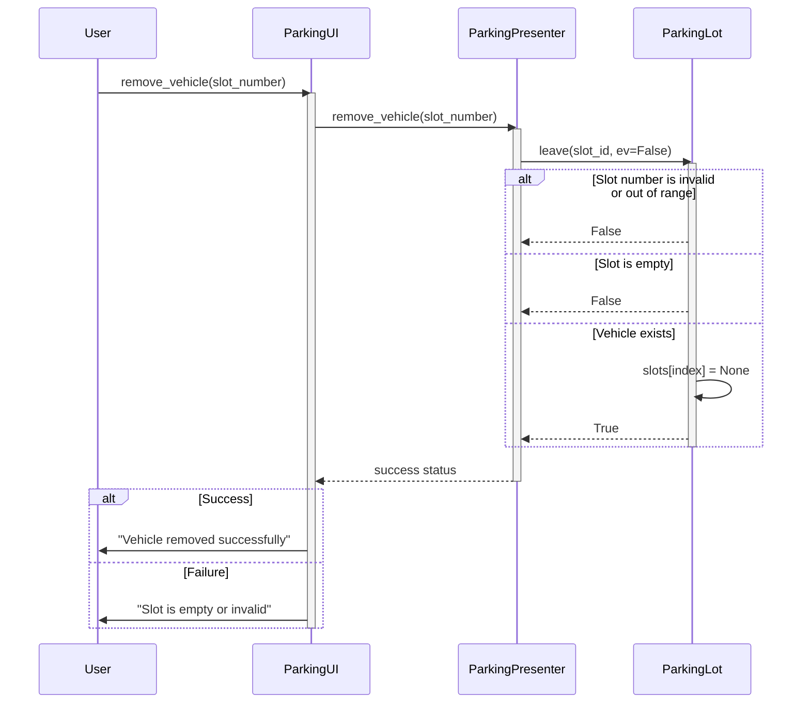
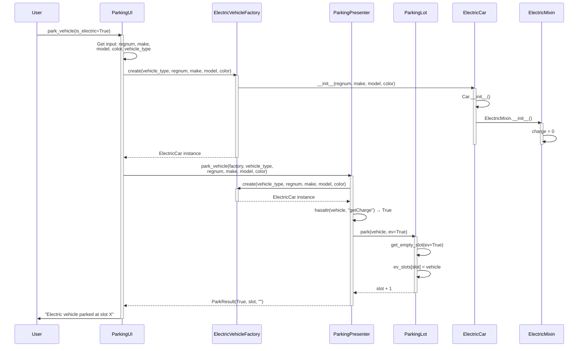

# Parking System - Behavioral (Sequence) Diagrams

## Sequence Diagram 1: Park a Regular Vehicle

## Sequence Diagram 2: View Parking Status

## Sequence Diagram 3: Remove Vehicle from Parking

## Sequence Diagram 4: Park an Electric Vehicle

