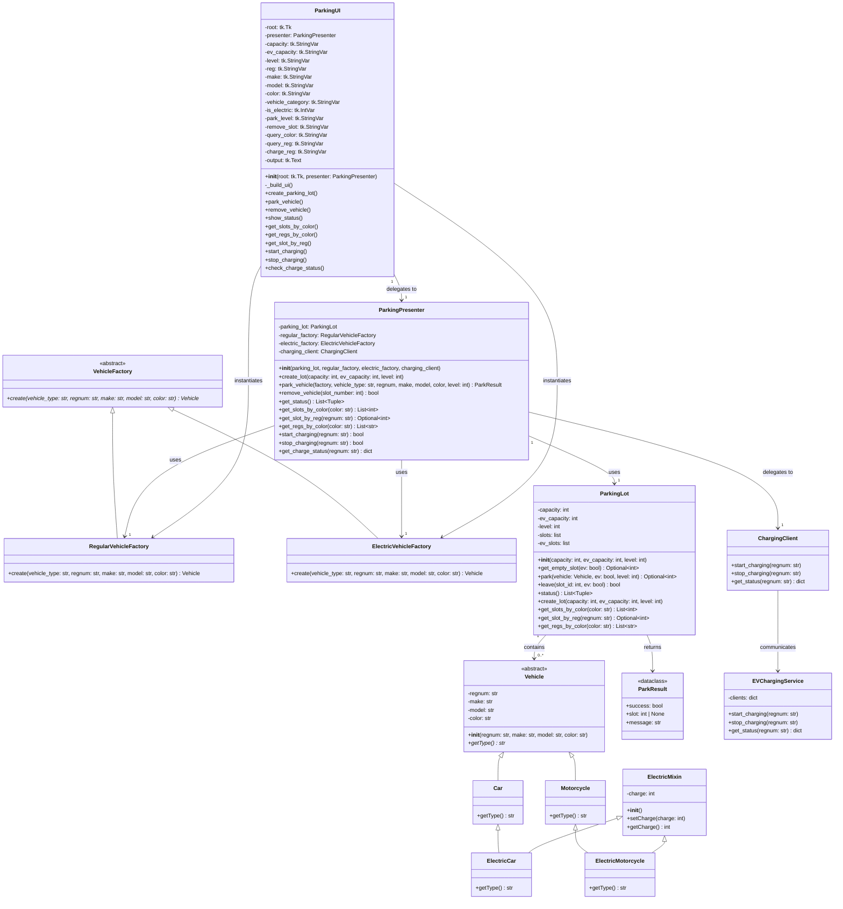

# Parking System - Class Diagram

## Legend

| Symbol | Meaning |
|--------|---------|
| `<<abstract>>` | Abstract class |
| `<<dataclass>>` | Python dataclass |
| `-` | Private attribute/method |
| `+` | Public attribute/method |
| `<\|--` | Inheritance (is-a) |
| `-->` | Association (uses) |
| `"1" --> "0..*"` | One-to-many relationship |
