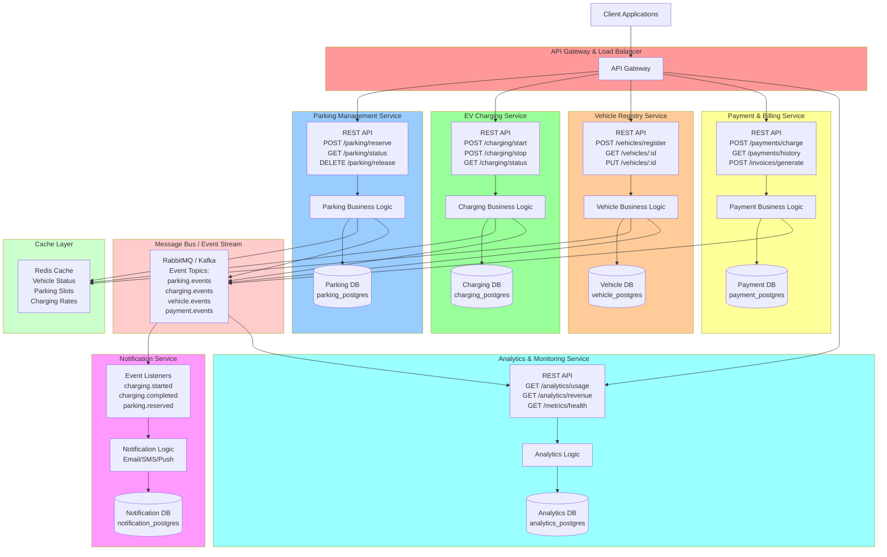

# Electric Vehicle Parking System - Microservices Architecture Diagram

## Proposed Microservices Architecture

## Service Details & Database Schema

### 1. **Parking Management Service**
- **Base URL**: `http://parking-service:3001`
- **Endpoints**:
  - `POST /parking/reserve` - Reserve a parking slot
  - `GET /parking/status` - Get all parking slots status
  - `GET /parking/slots/:id` - Get specific slot details
  - `DELETE /parking/release` - Release a parked vehicle
  - `GET /parking/history/:vehicleId` - Get parking history

- **Database**: `parking_postgres`
  - Tables: `parking_slots`, `parking_reservations`, `parking_history`, `lot_configuration`

---

### 2. **EV Charging Service**
- **Base URL**: `http://charging-service:3002`
- **Endpoints**:
  - `POST /charging/start` - Start charging session
  - `POST /charging/stop` - Stop charging session
  - `GET /charging/status/:vehicleId` - Get current charging status
  - `GET /charging/history/:vehicleId` - Get charging history
  - `GET /charging/rates` - Get current charging rates

- **Database**: `charging_postgres`
  - Tables: `charging_sessions`, `charging_history`, `charging_rates`, `charger_stations`

---

### 3. **Vehicle Registry Service**
- **Base URL**: `http://vehicle-service:3003`
- **Endpoints**:
  - `POST /vehicles/register` - Register a new vehicle
  - `GET /vehicles/:vehicleId` - Get vehicle details
  - `PUT /vehicles/:vehicleId` - Update vehicle information
  - `GET /vehicles/search?type=electric` - Search vehicles by type
  - `GET /vehicles/:vehicleId/status` - Get vehicle operational status

- **Database**: `vehicle_postgres`
  - Tables: `vehicles`, `vehicle_types`, `vehicle_registration`, `vehicle_status`

---

### 4. **Payment & Billing Service**
- **Base URL**: `http://payment-service:3004`
- **Endpoints**:
  - `POST /payments/charge` - Charge customer account
  - `GET /payments/history/:customerId` - Get payment history
  - `POST /invoices/generate` - Generate invoice
  - `GET /billing/estimate` - Calculate billing estimate
  - `POST /payments/refund` - Process refund

- **Database**: `payment_postgres`
  - Tables: `payments`, `invoices`, `billing_rates`, `transactions`, `refunds`

---

### 5. **Notification Service**
- **Base URL**: `http://notification-service:3005`
- **Event-Driven Architecture**
- **Listens to**:
  - `parking.reserved`
  - `parking.released`
  - `charging.started`
  - `charging.completed`
  - `charging.failed`
  - `payment.completed`

- **Database**: `notification_postgres`
  - Tables: `notifications`, `notification_queue`, `notification_templates`, `user_preferences`

---

### 6. **Analytics & Monitoring Service**
- **Base URL**: `http://analytics-service:3006`
- **Endpoints**:
  - `GET /analytics/usage` - Get usage statistics
  - `GET /analytics/revenue` - Get revenue metrics
  - `GET /metrics/health` - Get system health metrics
  - `GET /analytics/peak-hours` - Get peak usage hours
  - `GET /analytics/vehicle-types` - Get vehicle type distribution

- **Database**: `analytics_postgres`
  - Tables: `usage_metrics`, `revenue_metrics`, `system_health`, `event_logs`

---

## Infrastructure Components

### **API Gateway**
- Acts as single entry point for all clients
- Handles authentication, rate limiting, request routing
- Implements cross-cutting concerns (logging, security)

### **Message Bus (Event-Driven)**
- **Technology**: RabbitMQ or Apache Kafka
- **Event Topics**:
  - `parking.events` - Parking reservation/release events
  - `charging.events` - Charging start/stop events
  - `vehicle.events` - Vehicle registration/update events
  - `payment.events` - Payment completion events
  - `notification.events` - Notification delivery events

### **Cache Layer**
- **Technology**: Redis
- **Cached Data**:
  - Active parking slots status
  - Vehicle operational status
  - Charging rates
  - Popular search queries

### **Databases**
- All services use PostgreSQL (separate instances for data isolation)
- Each service owns its data schema
- Cross-service queries go through APIs only

---

## Communication Patterns

### Synchronous (Request-Response)
- Client → API Gateway → Service APIs
- Service-to-service communication for immediate responses
- REST/gRPC protocols

### Asynchronous (Event-Driven)
- Services publish events to Message Bus
- Notification and Analytics services consume events
- Decouples services, improves scalability

---

## Deployment Architecture

```mermaid
graph TB
    subgraph Kubernetes["Kubernetes Cluster"]
        subgraph NS["Namespace: production"]
            ParkingSvc["Parking Service<br/>Pod Replicas: 3"]
            ChargingSvc["Charging Service<br/>Pod Replicas: 3"]
            VehicleSvc["Vehicle Service<br/>Pod Replicas: 2"]
            PaymentSvc["Payment Service<br/>Pod Replicas: 2"]
            NotificationSvc["Notification Service<br/>Pod Replicas: 2"]
            AnalyticsSvc["Analytics Service<br/>Pod Replicas: 1"]
        end
        
        subgraph Infra["Infrastructure Services"]
            RabbitMQ["RabbitMQ Cluster<br/>3 Nodes"]
            Redis["Redis Cluster<br/>3 Nodes"]
            APIGw["API Gateway<br/>Ingress Controller"]
        end
    end
    
    subgraph DBCluster["Database Cluster"]
        ParkingDB["parking_postgres"]
        ChargingDB["charging_postgres"]
        VehicleDB["vehicle_postgres"]
        PaymentDB["payment_postgres"]
        NotificationDB["notification_postgres"]
        AnalyticsDB["analytics_postgres"]
    end
    
    ParkingSvc --> ParkingDB
    ChargingSvc --> ChargingDB
    VehicleSvc --> VehicleDB
    PaymentSvc --> PaymentDB
    NotificationSvc --> NotificationDB
    AnalyticsSvc --> AnalyticsDB
    
    ParkingSvc --> RabbitMQ
    ChargingSvc --> RabbitMQ
    VehicleSvc --> RabbitMQ
    PaymentSvc --> RabbitMQ
    NotificationSvc --> RabbitMQ
    AnalyticsSvc --> RabbitMQ
    
    ParkingSvc --> Redis
    ChargingSvc --> Redis
    VehicleSvc --> Redis
    
    APIGw --> ParkingSvc
    APIGw --> ChargingSvc
    APIGw --> VehicleSvc
    APIGw --> PaymentSvc
    APIGw --> AnalyticsSvc
    
    style Kubernetes fill:#e1f5ff
    style Infra fill:#fff3e0
    style DBCluster fill:#f3e5f5
    style NS fill:#e0f2f1
```

---

## Key Design Principles

1. **Single Responsibility**: Each service handles one business domain
2. **Database Per Service**: Data isolation and independence
3. **Event-Driven**: Async communication via message bus
4. **API-First**: All inter-service communication through APIs
5. **Scalability**: Services can be scaled independently
6. **Resilience**: Circuit breakers, retries, fallbacks
7. **Monitoring**: Centralized logging and metrics collection

---

## Technology Stack

| Component | Technology |
|-----------|------------|
| API Gateway | Kong / Nginx Ingress |
| Services | Python / FastAPI / Flask |
| Message Bus | RabbitMQ / Kafka |
| Cache | Redis |
| Databases | PostgreSQL |
| Container Orchestration | Kubernetes |
| Logging | ELK Stack (Elasticsearch, Logstash, Kibana) |
| Monitoring | Prometheus + Grafana |
| CI/CD | GitLab CI / GitHub Actions |

