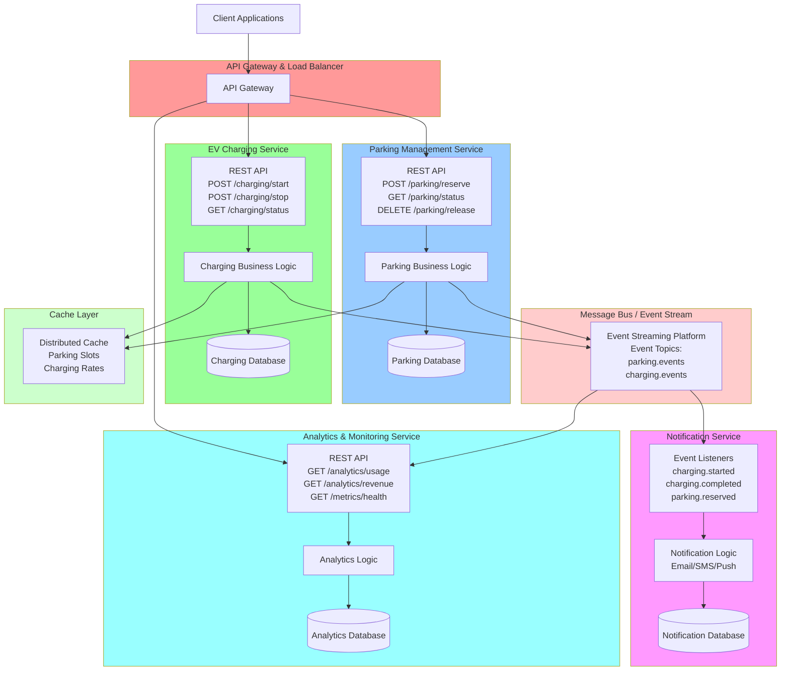
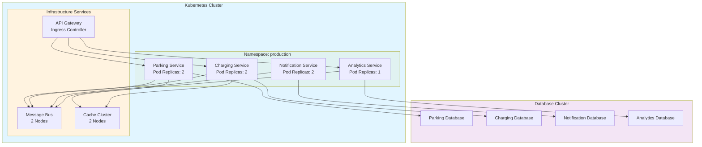

# Electric Vehicle Parking System - Microservices Architecture Diagram

## Proposed Microservices Architecture

## Service Details & Database Schema

### 1. **Parking Management Service**
- **Base URL**: `http://parking-service:3001`
- **Endpoints**:
  - `POST /parking/reserve` - Reserve a parking slot
  - `GET /parking/status` - Get all parking slots status
  - `GET /parking/slots/:id` - Get specific slot details
  - `DELETE /parking/release` - Release a parked vehicle
  - `GET /parking/history/:vehicleId` - Get parking history

- **Database**: Parking Database
  - Tables: `parking_slots`, `parking_reservations`, `parking_history`, `lot_configuration`

---

### 2. **EV Charging Service**
- **Base URL**: `http://charging-service:3002`
- **Endpoints**:
  - `POST /charging/start` - Start charging session
  - `POST /charging/stop` - Stop charging session
  - `GET /charging/status/:vehicleId` - Get current charging status
  - `GET /charging/history/:vehicleId` - Get charging history
  - `GET /charging/rates` - Get current charging rates

- **Database**: Charging Database
  - Tables: `charging_sessions`, `charging_history`, `charging_rates`, `charger_stations`

---

### 3. **Notification Service**
- **Base URL**: `http://notification-service:3003`
- **Event-Driven Architecture**
- **Listens to**:
  - `parking.reserved`
  - `parking.released`
  - `charging.started`
  - `charging.completed`
  - `charging.failed`

- **Database**: Notification Database
  - Tables: `notifications`, `notification_queue`, `notification_templates`, `user_preferences`

---

### 4. **Analytics & Monitoring Service**
- **Base URL**: `http://analytics-service:3004`
- **Endpoints**:
  - `GET /analytics/usage` - Get usage statistics
  - `GET /analytics/revenue` - Get revenue metrics
  - `GET /metrics/health` - Get system health metrics
  - `GET /analytics/peak-hours` - Get peak usage hours
  - `GET /analytics/vehicle-types` - Get vehicle type distribution

- **Database**: Analytics Database
  - Tables: `usage_metrics`, `revenue_metrics`, `system_health`, `event_logs`

---

## Infrastructure Components

### **API Gateway**
- Acts as single entry point for all clients
- Handles authentication, rate limiting, request routing
- Implements cross-cutting concerns (logging, security)

### **Message Bus (Event-Driven)**
- **Event Topics**:
  - `parking.events` - Parking reservation/release events
  - `charging.events` - Charging start/stop events

### **Cache Layer**
- **Cached Data**:
  - Active parking slots status
  - Charging rates

### **Databases**
- Separate instances for data isolation
- Each service owns its data schema
- Cross-service queries go through APIs only

---

## Communication Patterns

### Synchronous (Request-Response)
- Client → API Gateway → Service APIs
- Service-to-service communication for immediate responses
- REST/gRPC protocols

### Asynchronous (Event-Driven)
- Services publish events to Message Bus
- Notification and Analytics services consume events
- Decouples services, improves scalability

---

## Deployment Architecture

---

## Key Design Principles

1. **Single Responsibility**: Each service handles one business domain
2. **Database Per Service**: Data isolation and independence
3. **Event-Driven**: Async communication via message bus
4. **API-First**: All inter-service communication through APIs
5. **Scalability**: Services can be scaled independently
6. **Resilience**: Circuit breakers, retries, fallbacks
7. **Monitoring**: Centralized logging and metrics collection

